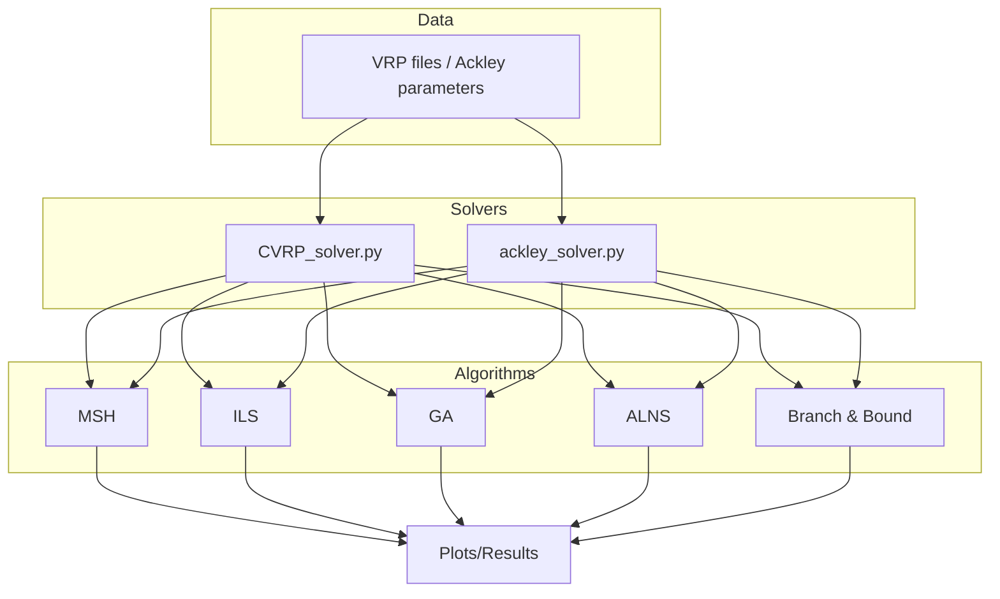

# AI Lab 3 – CVRP and Ackley Solvers

## Project Overview
This repository contains Python implementations of several metaheuristic algorithms for solving two optimization problems:

* **Capacitated Vehicle Routing Problem (CVRP)** – minimizing total distance for a fleet of vehicles with capacity constraints.
* **10‑D Ackley Function** – finding the global minimum of a non‑convex function.

The project offers multiple algorithms (MSH, ILS, GA with islands, ALNS, Branch & Bound) that can be run individually or compared. Scripts output solution routes, cost statistics and optional plots.

## Architecture Diagram


## Directory & File Structure
```
.
├── ALNS.py                   # Adaptive Large Neighborhood Search
├── BranchBound_LDS.py        # Branch & Bound with Limited Discrepancy Search
├── CVRP_solver.py            # Simple command line interface for CVRP problems
├── GA_with_islands.py        # Genetic Algorithm with island model
├── ILS.py                    # Iterated Local Search with metaheuristics
├── ILS_Ackley.py             # ILS variant for Ackley optimization
├── MSH.py                    # Multi‑Stage Heuristic for CVRP
├── MSH_Ackley.py             # MSH variant for Ackley
├── ackley_solver.py          # Main dispatcher for Ackley problem
├── cvrp_master_tester.py     # Batch tester for multiple VRP instances
├── cvrp_solver_test2.py      # Alternative CVRP solver runner
├── plots/                    # Plot helpers and example results
├── problems/                 # VRP benchmark instances (.vrp/.sol)
├── utils.py                  # Shared utility functions
└── requirements.txt          # Python dependencies
```
Top‑level folders:
* **plots/** – plotting utilities and saved experiment images.
* **problems/** – VRP instances grouped by difficulty (beginner, intermediate, advanced, x80, xprob).

## Core Components
### `ALNS.py`
Adaptive Large Neighborhood Search used for both CVRP and Ackley. Provides destroy/repair operators, simulated annealing style acceptance, and parameters for removal fraction and weights.

### `BranchBound_LDS.py`
Branch & Bound implementation enhanced with Limited Discrepancy Search and k‑means seeding. Contains route fitness evaluation, 2‑opt optimization and search parameters like `max_discrepancies`.

### `GA_with_islands.py`
Genetic algorithm employing multiple islands with migration. Uses k‑means clustering for initial populations and adaptive mutation/two‑opt rates. Key functions include `ga_island_model_solver` and helpers for fitness evaluation.

### `ILS.py`
Iterated Local Search for CVRP combining Tabu Search, Ant Colony Optimization and Simulated Annealing. Provides neighborhood operators (`relocate`, `swap`, `cross_exchange`, `two_opt`), local search steps and metaheuristic drivers.

### `MSH.py`
Multi‑Stage Heuristic based on a multi‑knapsack formulation followed by local TSP optimization within clusters.

### `ackley_solver.py`
Command line entry for Ackley optimization. Dispatches to GA, ALNS, Branch & Bound, ILS or MSH according to the chosen `METHOD`. Generates plots for convergence and stores results in `plots/<timestamp>`.

### `CVRP_solver.py`
Simple CLI front‑end for solving one or more `.vrp` files. Selects algorithm (`MSH`, `ILS`, `GA`, `ALNS`, `B&B`), parses problem data and compares against provided `.sol` solutions.

### `cvrp_master_tester.py`
Batch runner for evaluating all algorithms on a directory of VRP instances. Handles plotting of routes and convergence curves.

### `utils.py`
Collection of shared helpers: distance and cost calculations, solution validation, initialization via nearest neighbors, and mutation operators.

## Installation & Setup
```bash
# clone repository
git clone <repo-url>
cd AI_LAB3

# create virtual environment
python3 -m venv venv
source venv/bin/activate

# install dependencies
pip install -r requirements.txt
```
Optional: export `DISPLAY_PLOTS=1` to show matplotlib windows. Without it, images are saved to the `plots/` directory.

## Usage & Execution
Run the Ackley solver:
```bash
python ackley_solver.py GA time_limit=300
```
Run the CVRP solver on a specific instance:
```bash
python CVRP_solver.py ILS problems/intermediate/A-n32-k5.vrp 1200
```
Or process an entire folder:
```bash
python cvrp_solver_test2.py GA problems/intermediate
```
Results (routes and convergence plots) are stored under `plots/<timestamp>/`.

## Configuration Options
Parameters can be passed as `key=value` pairs on the command line. Examples:

* `pop_size`, `gens`, `mut_rate` – genetic algorithm controls.
* `iterations`, `remove_low`, `remove_high` – ALNS tuning.
* `time_limit` – maximum runtime in seconds for most algorithms.
* `meta_heuristic` – choose `aco`, `simulated_annealing` or `tabu_search` for ILS.

Defaults are defined inside each script and used when parameters are omitted.

## Known Limitations & Potential Drawbacks

* Some algorithms may consume significant CPU time on large VRP instances.
* Parameters and file paths are largely hardcoded within scripts.
* No automated tests or continuous integration setup.
* Requires Python packages listed in `requirements.txt` (NumPy, pandas, matplotlib, scikit‑learn, pulp).

## Contributing Guidelines
No `CONTRIBUTING.md` is provided. Standard GitHub pull request workflow is recommended.
